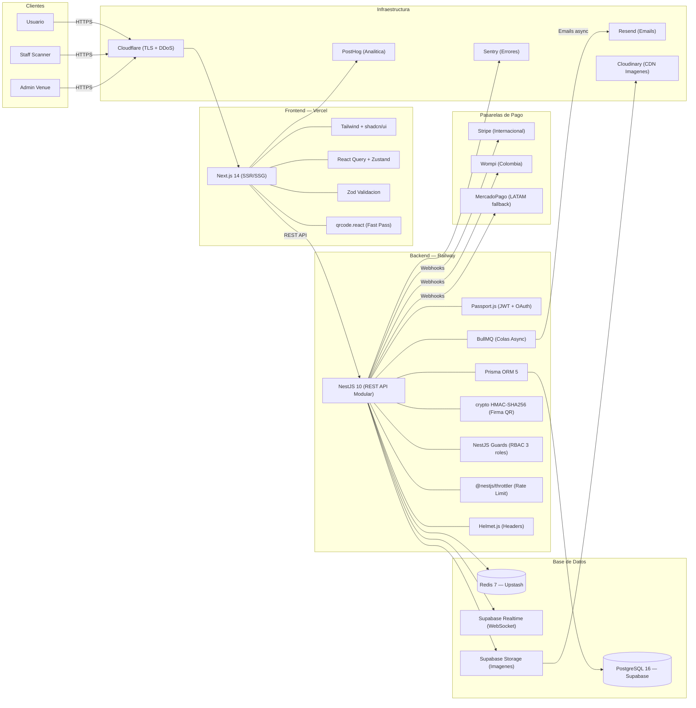
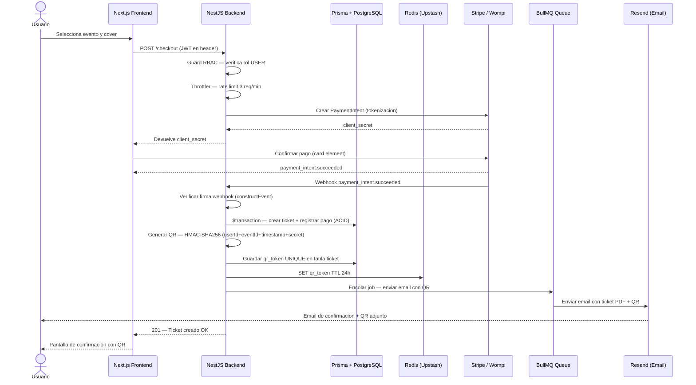
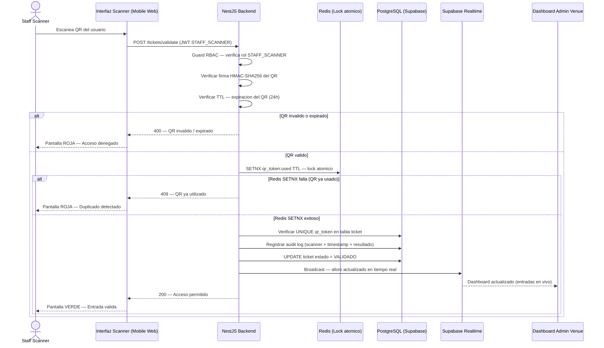
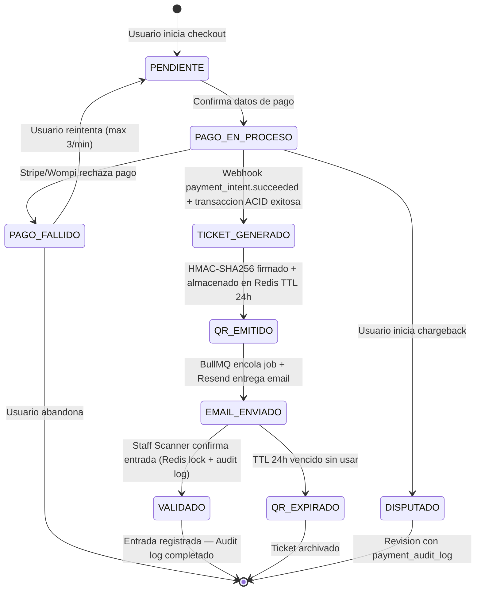
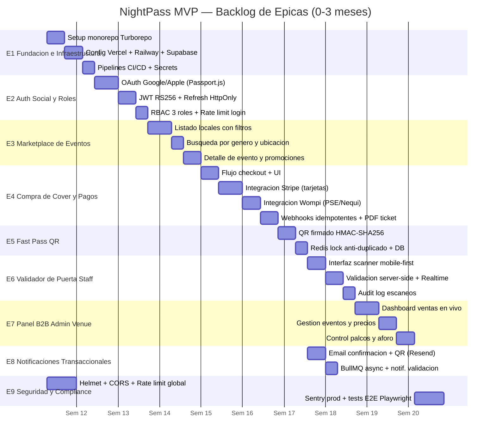
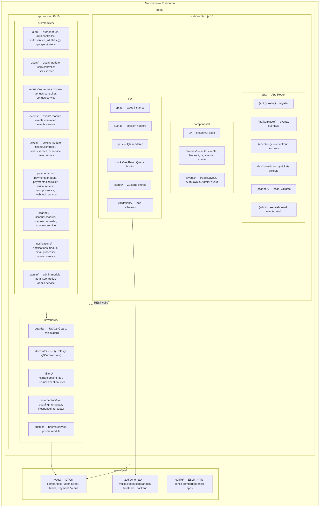

# NightPass — Documentación UML Completa

> Todos los diagramas de arquitectura, flujos y estructura del proyecto.
> Stack: NestJS 10 + Next.js 14 + PostgreSQL 16 + Redis 7 + Supabase + Stripe + Wompi
> Versión: MVP v2.0 · Marzo 2026

---

## Índice

1. [Arquitectura General](#1-arquitectura-general)
2. [Flujo de Compra de Cover y Pagos](#2-flujo-de-compra-de-cover-y-pagos)
3. [Flujo de Validación QR en Puerta](#3-flujo-de-validación-qr-en-puerta)
4. [Estados del Ticket y QR Fast Pass](#4-estados-del-ticket-y-qr-fast-pass)
5. [Pipeline CI/CD](#5-pipeline-cicd)
6. [Gantt — Épicas del MVP](#6-gantt--épicas-del-mvp)
7. [ERD — Esquema de Base de Datos](#7-erd--esquema-de-base-de-datos)
8. [Matriz de Permisos por Rol](#8-matriz-de-permisos-por-rol)
9. [Estructura de Módulos del Monorepo](#9-estructura-de-módulos-del-monorepo)

---

## 1. Arquitectura General

Muestra todas las capas del sistema: clientes, frontend en Vercel (Next.js), backend en Railway (NestJS), bases de datos (PostgreSQL + Redis), pasarelas de pago y servicios de infraestructura.



---

## 2. Flujo de Compra de Cover y Pagos

Secuencia completa desde que el usuario selecciona un evento hasta que recibe el email con el QR. Incluye verificación HMAC, transacción ACID y cola async de emails.



---

## 3. Flujo de Validación QR en Puerta

Secuencia de validación del QR: verificación HMAC, lock atómico en Redis para prevenir duplicados simultáneos, registro en audit log y actualización en tiempo real del dashboard del Admin.



---

## 4. Estados del Ticket y QR Fast Pass

Ciclo de vida completo de un ticket: desde el inicio del checkout hasta los estados finales (VALIDADO, EXPIRADO o DISPUTADO).



---

## 5. Pipeline CI/CD

Flujo completo desde el desarrollo local con Husky hasta el deploy automático en producción, pasando por el pipeline de GitHub Actions.

```mermaid
flowchart LR
  subgraph DEV["Desarrollo Local"]
    CODE["Codigo (Monorepo Turborepo)"]
    HC["Husky Pre-commit lint-staged"]
    LINT["ESLint + Prettier (bloquea si falla)"]
  end

  subgraph GH["GitHub"]
    PR["Pull Request abierto"]
    CR["Code Review aprobado"]
    MAIN["Merge a main"]
  end

  subgraph CI["GitHub Actions — CI Pipeline"]
    L["1. Lint + Type-check"]
    TC["2. Tests Unitarios Vitest / Jest"]
    E2E["3. Tests E2E Playwright (compra + QR)"]
    AUDIT["4. npm audit (vulnerabilidades criticas)"]
    BUILD["5. Build Next.js + NestJS"]
  end

  subgraph CD["CD — Deploy Automatico"]
    PV["Preview Deploy Vercel (por PR)"]
    STG["Staging Railway + Supabase"]
    QA["QA en Staging (pagos sandbox)"]
    DPROD["Deploy Produccion Vercel + Railway"]
  end

  subgraph OBS["Observabilidad"]
    SN["Sentry (errores en prod)"]
    PH["PostHog (analitica + funnels)"]
    SR["Semantic Release (versionado automatico)"]
  end

  CODE --> HC --> LINT --> PR --> CR --> MAIN
  MAIN --> L --> TC --> E2E --> AUDIT --> BUILD
  BUILD -->|"tests OK"| PV
  PV --> STG --> QA --> DPROD
  DPROD --> SN & PH & SR
  AUDIT -->|"vulnerabilidad critica"| FAIL["Build falla — bloquea merge"]
```



---

## 6. Gantt — Épicas del MVP

Distribución temporal de las 9 épicas del MVP en un horizonte de 0 a 3 meses.



---

## 7. ERD — Esquema de Base de Datos

Esquema relacional completo con las 9 tablas del sistema, sus campos, tipos de datos y relaciones. Corresponde exactamente al archivo `apps/api/prisma/schema.prisma`.

```mermaid
erDiagram
  USER {
    uuid id PK
    string email UK
    string name
    string passwordHash
    enum provider "LOCAL|GOOGLE|APPLE"
    enum role "USER|STAFF_SCANNER|ADMIN_VENUE"
    string avatarUrl
    boolean isActive
    timestamp createdAt
    timestamp updatedAt
  }

  VENUE {
    uuid id PK
    uuid ownerId FK
    string name
    string city
    string address
    int capacity
    string description
    string coverImageUrl
    boolean isActive
    timestamp createdAt
  }

  TABLE_PALCO {
    uuid id PK
    uuid venueId FK
    string name
    int capacity
    decimal price
    string description
    boolean isActive
  }

  EVENT {
    uuid id PK
    uuid venueId FK
    string name
    string description
    timestamp date
    timestamp doorsOpen
    decimal coverPrice
    int maxCapacity
    int ticketsSold
    string musicGenre
    string bannerImageUrl
    enum status "DRAFT|PUBLISHED|CANCELLED"
    timestamp createdAt
  }

  PROMOTION {
    uuid id PK
    uuid eventId FK
    string title
    enum discountType "PERCENT|FIXED"
    decimal discountValue
    int maxUses
    int usesCount
    timestamp validUntil
    string code UK
    boolean isActive
  }

  TABLE_EVENT_RESERVATION {
    uuid id PK
    uuid tableId FK
    uuid eventId FK
    uuid userId FK
    enum status "AVAILABLE|RESERVED|CONFIRMED"
    decimal price
    timestamp createdAt
  }

  PAYMENT {
    uuid id PK
    uuid userId FK
    uuid eventId FK
    decimal amount
    string currency
    enum gateway "STRIPE|WOMPI|MERCADOPAGO"
    string gatewayPaymentId UK
    string idempotencyKey UK
    enum status "PENDING|SUCCEEDED|FAILED|REFUNDED|DISPUTED"
    timestamp createdAt
    timestamp updatedAt
  }

  TICKET {
    uuid id PK
    uuid userId FK
    uuid eventId FK
    uuid paymentId FK UK
    string qrToken UK
    string qrSignedPayload
    enum status "PENDING|ACTIVE|VALIDATED|EXPIRED|CANCELLED"
    timestamp validatedAt
    timestamp createdAt
  }

  PAYMENT_AUDIT_LOG {
    uuid id PK
    uuid paymentId FK
    string action
    string gatewayEvent
    json metadata
    timestamp createdAt
  }

  SCAN_AUDIT_LOG {
    uuid id PK
    uuid ticketId FK
    uuid scannerId FK
    enum result "SUCCESS|INVALID|DUPLICATE|EXPIRED"
    string ipAddress
    timestamp scannedAt
  }

  USER ||--o{ VENUE : "owner"
  USER ||--o{ TICKET : "compra"
  USER ||--o{ PAYMENT : "realiza"
  USER ||--o{ SCAN_AUDIT_LOG : "escanea"
  USER ||--o{ TABLE_EVENT_RESERVATION : "reserva"
  VENUE ||--o{ EVENT : "tiene"
  VENUE ||--o{ TABLE_PALCO : "tiene"
  TABLE_PALCO ||--o{ TABLE_EVENT_RESERVATION : "tiene"
  EVENT ||--o{ TICKET : "genera"
  EVENT ||--o{ PROMOTION : "tiene"
  EVENT ||--o{ TABLE_EVENT_RESERVATION : "tiene"
  EVENT ||--o{ PAYMENT : "recibe"
  PAYMENT ||--|| TICKET : "origina"
  PAYMENT ||--o{ PAYMENT_AUDIT_LOG : "registra"
  TICKET ||--o{ SCAN_AUDIT_LOG : "genera"
```

---

## 8. Matriz de Permisos por Rol

Qué puede hacer cada rol en cada grupo de endpoints. Leyenda: SI = permitido, NO = denegado (403).

| Endpoint                  | Metodo | USER    | STAFF_SCANNER | ADMIN_VENUE |
| ------------------------- | ------ | ------- | ------------- | ----------- |
| /auth/register            | POST   | SI      | SI            | SI          |
| /auth/login               | POST   | SI      | SI            | SI          |
| /auth/google              | GET    | SI      | SI            | SI          |
| /auth/refresh             | POST   | SI      | SI            | SI          |
| /auth/logout              | POST   | SI      | SI            | SI          |
| /users/me                 | GET    | SI      | SI            | SI          |
| /users/me                 | PATCH  | SI      | SI            | SI          |
| /venues                   | GET    | SI      | SI            | SI          |
| /venues/:id               | GET    | SI      | SI            | SI          |
| /venues                   | POST   | NO      | NO            | SI          |
| /venues/:id               | PATCH  | NO      | NO            | SI          |
| /venues/:id/dashboard     | GET    | NO      | NO            | SI          |
| /events                   | GET    | SI      | SI            | SI          |
| /events/:id               | GET    | SI      | SI            | SI          |
| /events                   | POST   | NO      | NO            | SI          |
| /events/:id               | PATCH  | NO      | NO            | SI          |
| /events/:id/publish       | PATCH  | NO      | NO            | SI          |
| /events/:id/stats         | GET    | NO      | NO            | SI          |
| /tickets/checkout         | POST   | SI      | NO            | NO          |
| /tickets/my               | GET    | SI      | NO            | NO          |
| /tickets/:id              | GET    | SI      | NO            | NO          |
| /tickets/validate         | POST   | NO      | SI            | NO          |
| /tickets/event/:id        | GET    | NO      | NO            | SI          |
| /payments/webhook/stripe  | POST   | Sistema | Sistema       | Sistema     |
| /payments/webhook/wompi   | POST   | Sistema | Sistema       | Sistema     |
| /payments/my              | GET    | SI      | NO            | NO          |
| /payments/event/:id       | GET    | NO      | NO            | SI          |
| /staff/assign             | POST   | NO      | NO            | SI          |
| /staff/scan-logs/:eventId | GET    | NO      | SI            | SI          |

### Roles del sistema

| Rol           | Descripcion             | Casos de uso                                           |
| ------------- | ----------------------- | ------------------------------------------------------ |
| USER          | Comprador de covers     | Buscar eventos, comprar tickets, ver QR, ver historial |
| STAFF_SCANNER | Validador de puerta     | Escanear QR en la entrada, ver logs de su evento       |
| ADMIN_VENUE   | Administrador del local | Crear eventos, ver dashboard, gestionar palcos y staff |

---

## 9. Estructura de Módulos del Monorepo

Organización completa del monorepo Turborepo con las dos apps y los packages compartidos.



---

## Resumen del Stack Tecnológico

### Frontend

| Tecnología    | Versión | Rol                             |
| ------------- | ------- | ------------------------------- |
| Next.js       | 14+     | Framework principal con SSR/SSG |
| TypeScript    | 5.x     | Lenguaje base                   |
| Tailwind CSS  | 3.x     | Estilos utilitarios             |
| shadcn/ui     | latest  | Componentes accesibles          |
| React Query   | 5.x     | Fetching y cache del cliente    |
| Zustand       | 4.x     | Estado global                   |
| Zod           | 3.x     | Validacion de schemas           |
| qrcode.react  | 3.x     | Generacion de QR Fast Pass      |
| Framer Motion | 11.x    | Animaciones UI                  |

### Backend

| Tecnología    | Versión  | Rol                             |
| ------------- | -------- | ------------------------------- |
| NestJS        | 10.x     | Framework API REST modular      |
| TypeScript    | 5.x      | Lenguaje base                   |
| Prisma ORM    | 5.x      | ORM + migraciones               |
| Passport.js   | 0.7      | Estrategias de auth             |
| BullMQ        | 4.x      | Colas de trabajo async          |
| crypto (Node) | built-in | Firma HMAC-SHA256 para QR       |
| Swagger       | 7.x      | Documentacion API auto-generada |

### Infraestructura

| Servicio         | Proveedor  | Rol                            |
| ---------------- | ---------- | ------------------------------ |
| PostgreSQL 16    | Supabase   | DB transaccional principal     |
| Redis 7          | Upstash    | Cache, sesiones, locks QR      |
| Frontend hosting | Vercel     | Deploy auto + CDN global       |
| Backend hosting  | Railway    | Deploy NestJS                  |
| DNS + DDoS       | Cloudflare | TLS automatico + proteccion L7 |
| Emails           | Resend     | Tickets, confirmaciones        |
| Errores          | Sentry     | Alertas en tiempo real         |
| Analitica        | PostHog    | Funnels y retencion            |

### Seguridad por capas (Defense in Depth)

| Capa          | Mecanismo                                     | Protege contra             |
| ------------- | --------------------------------------------- | -------------------------- |
| Transporte    | TLS 1.3 via Cloudflare                        | Intercepcion de trafico    |
| Autenticacion | JWT RS256 + OAuth 2.1 + PKCE                  | Robo de credenciales       |
| Autorizacion  | RBAC con NestJS Guards                        | Acceso no autorizado       |
| QR            | HMAC-SHA256 + TTL 24h + Redis SETNX           | Falsificacion y duplicados |
| Pagos         | Tokenizacion Stripe/Wompi + Webhooks firmados | PCI DSS                    |
| API           | Helmet.js + CORS estricto + Rate limiting     | XSS, DDoS, fuerza bruta    |
| Datos         | Prisma prepared statements                    | SQL injection              |
| Auditoria     | Logs inmutables (append-only)                 | Disputas y chargebacks     |

---

## 10. Documentación de Referencia

### Documentación Técnica Disponible

| Documento                   | Ubicación                                              | Descripción                                         |
| --------------------------- | ------------------------------------------------------ | --------------------------------------------------- |
| **API Endpoints**           | [`docs/API_ENDPOINTS.md`](docs/API_ENDPOINTS.md)       | Especificación completa de todos los endpoints REST |
| **Swagger UI**              | `http://localhost:3001/api/docs`                       | Documentación interactiva de la API                 |
| **OpenAPI Spec**            | `http://localhost:3001/api/docs-json`                  | Especificación OpenAPI 3.0 en JSON                  |
| **README Principal**        | [`README.md`](README.md)                               | Guía completa de inicio y uso                       |
| **Estructura del Proyecto** | [`ESTRUCTURA_EXPLICADA.txt`](ESTRUCTURA_EXPLICADA.txt) | Explicación detallada de cada archivo               |
| **Guía de Onboarding**      | [`ONBOARDING.txt`](ONBOARDING.txt)                     | Instrucciones para nuevos colaboradores             |

### Relación entre Diagramas y Implementación

Los diagramas de esta documentación corresponden directamente a:

1. **Arquitectura General** → Configuración en [`apps/api/src/main.ts`](apps/api/src/main.ts)
2. **ERD de Base de Datos** → Schema Prisma en [`apps/api/prisma/schema.prisma`](apps/api/prisma/schema.prisma)
3. **Flujos de Compra y Validación** → Lógica en módulos `tickets/` y `scanner/`
4. **Matriz de Permisos** → Implementación en [`apps/api/src/shared/guards/`](apps/api/src/shared/guards/)
5. **Estructura de Módulos** → Organización real del monorepo

### Próximas Actualizaciones de Diagramas

- Actualizar Gantt cuando se completen épicas del MVP
- Añadir diagrama de secuencia para notificaciones por email
- Incluir diagrama de deployment multi-región
- Actualizar ERD cuando se añadan nuevas tablas

---

_NightPass — Documentacion UML v2.1 — Marzo 2026_

> **Nota**: Esta documentación se mantiene sincronizada con el código. Cualquier cambio en la arquitectura debe reflejarse aquí.
